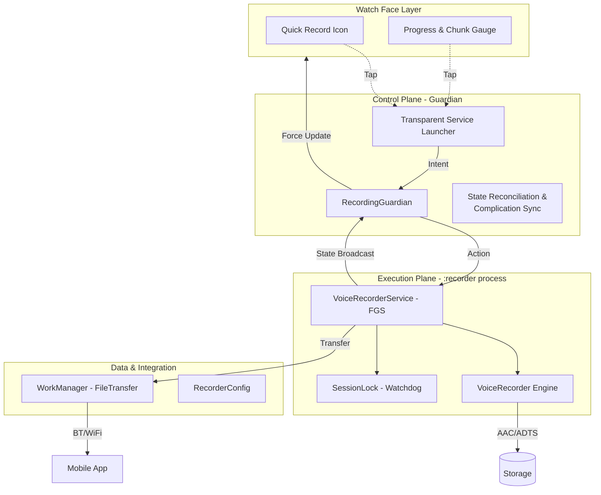

# TalkToTheHand ✋⌚

**TalkToTheHand** is a robust, battery-efficient voice recorder for **Wear OS**, complete with an **Android Mobile** companion app for file management and remote configuration.

The app is architected for reliability, featuring background recording, resilient file transfers, and detailed telemetry for debugging.

> **Note:** The entire codebase, architecture, and documentation for this project were generated with the assistance of **Google Gemini**.

## Features

### ⌚ Wear OS App (v1.3.0 New ✨)
*   **Enhanced Real-time Watch Face Complications:**
    *   **High-Fidelity Progress Gauge:** Updated the progress arc to refresh every 1/30 of a chunk size (~3.3% increment), providing a much smoother visual experience.
    *   **Instant UI Sync:** Immediate state reflection on the watch face as soon as recording starts or stops, eliminating the previous update lag.
    *   **Quick Control:** Toggle recording start/stop directly from your watch face without opening the app.
    *   **Session Statistics:** Real-time display of the total number of chunks recorded in the current session.
    *   **Foreground Reliability:** Uses a robust "Guardian" pattern to ensure complications are always in sync with the recording engine, even when the screen is dimmed.
*   **Resilient Recording:** Uses a **Foreground Service** with `FOREGROUND_SERVICE_TYPE_MICROPHONE` to ensure continuous capture. Includes a crash-recovery mechanism that preserves audio even after sudden reboots.
*   **Advanced Power Saving:** 
    *   **Balanced Update Strategy:** Optimized telemetry and heartbeat intervals (30s) to maximize battery life while maintaining system health.
    *   **Write Batching:** Minimizes storage I/O power drain using an efficient 16KB buffer and crash-resilient fsyncs.
    *   **Configurable VAD:** Features a software-based Voice Activity Detection with an **"Aggressive" mode** (with exponential backoff) for maximum power savings during silence.
*   **Crash-Proof Files:** Saves audio in a streamable **ADTS AAC** format, ensuring files are always playable even if the app crashes mid-recording.

### 📱 Mobile Companion App
*   **Live Transfer Status:** Shows the real-time status of incoming file transfers.
*   **Full Remote Configuration:** Configure all watch settings (chunk size, storage limits, bitrate, sample rate, power-saving modes) directly from the phone.
*   **Easy File Access:** Saves recordings to the public `Downloads/TalkToTheHand` folder.
*   **Telemetry Logging:** Receives and saves error and event logs from the watch for easy troubleshooting.

## Tech Stack

*   **Language:** Kotlin
*   **UI:** Jetpack Compose (Wear & Mobile)
*   **Architecture:** Multi-process Isolation (Control Plane vs. Execution Plane)
*   **Concurrency:** Kotlin Coroutines & StateFlow
*   **Connectivity:** Google Play Services Wearable Data Layer (`ChannelClient`, `MessageClient`)
*   **Audio:** Android `AudioRecord` & `MediaCodec` (AAC/ADTS)

## High-Level Architecture (v1.3.0)

The system utilizes a dual-process architecture to bypass Android 14+ background microphone restrictions while ensuring 100% UI consistency.

## Downloads

Latest pre-built APKs are available on the **[Releases Page](https://github.com/romntica/TalkToTheHand/releases)**.

## License

This project is licensed under the MIT License - see the [LICENSE](LICENSE) file for details.
