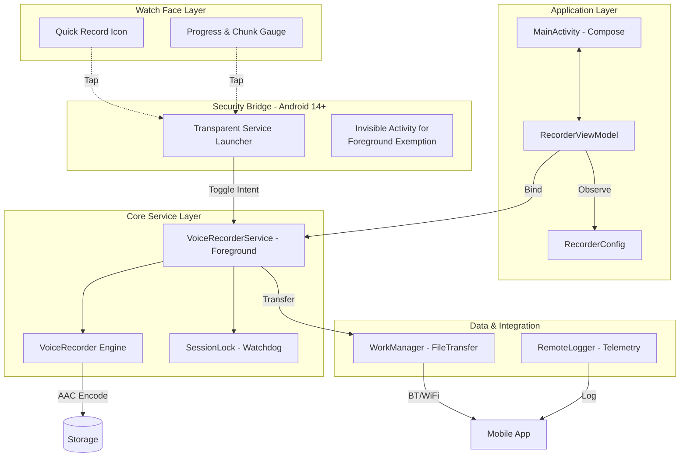

# TalkToTheHand ✋⌚

**TalkToTheHand** is a robust, battery-efficient voice recorder for **Wear OS**, complete with an **Android Mobile** companion app for file management and remote configuration.

The app is architected for reliability, featuring background recording, resilient file transfers, and detailed telemetry for debugging.

> **Note:** The entire codebase, architecture, and documentation for this project were generated with the assistance of **Google Gemini**.

## Features

### ⌚ Wear OS App (v1.2.0 New ✨)
*   **Advanced Watch Face Complications:**
    *   **Quick Control:** Toggle recording start/stop directly from your watch face without opening the app.
    *   **Live Progress Gauge:** A high-visibility segmented arc showing the current chunk's recording progress.
    *   **Session Statistics:** Real-time display of the total number of chunks recorded in the current session.
    *   **Seamless Integration:** Fully optimized for Android 14/15 restrictions using invisible bridge technology for instant background activation.
*   **Resilient Recording:** Uses a **Foreground Service** to ensure recording continues if the app is backgrounded. Automatically recovers from hardware errors.
*   **Advanced Power Saving:** Implements multiple strategies to maximize battery life:
    *   **Write Batching:** Minimizes power-hungry storage writes by using a small, efficient buffer with frequent fsyncs.
    *   **Configurable VAD:** Features a software-based Voice Activity Detection with a "Standard" mode and an **"Aggressive" mode** (with exponential backoff).
*   **Crash-Proof Files:** Saves audio in a raw **ADTS AAC** format, ensuring files are always playable, even if the app crashes mid-recording.
*   **Smart Storage Management:** Automatically stops when a configurable storage limit is reached and discards insignificant recordings (shorter than 2 seconds).
*   **Resilient File Transfer:** Uses `WorkManager` with an exponential backoff policy to reliably transfer recordings to the paired phone.

### 📱 Mobile Companion App
*   **Live Transfer Status:** Shows the real-time status of incoming file transfers.
*   **Full Remote Configuration:** Configure all watch settings (chunk size, storage limits, bitrate, sample rate, power-saving modes) directly from the phone.
*   **Easy File Access:** Saves recordings to the public `Downloads/TalkToTheHand` folder.
*   **Telemetry Logging:** Receives and saves error and event logs from the watch for easy troubleshooting.

## Tech Stack

*   **Language:** Kotlin
*   **UI:** Jetpack Compose (Wear & Mobile)
*   **Architecture:** MVVM-style with a Service layer & Security Bridge
*   **Concurrency:** Kotlin Coroutines & StateFlow
*   **Connectivity:** Google Play Services Wearable Data Layer (`ChannelClient`, `MessageClient`)
*   **Audio:** Android `AudioRecord` & `MediaCodec` (AAC/ADTS)

## High-Level Architecture (v1.2.0)

The system is designed with a multi-layered approach to bypass Android 14+ background microphone restrictions while maintaining a seamless user experience.

## Downloads

Latest pre-built APKs are available on the **[Releases Page](https://github.com/romntica/TalkToTheHand/releases)**.

## Settings (v1.2.0)

1.  **Max Chunk Size:** The size of each audio file before it is split.
2.  **Silence Power Saving:** 
    *   **Standard (Reliable):** Sleeps the CPU but keeps the microphone active.
    *   **Aggressive (Battery Saver):** Powers down the microphone during long silences (10s threshold) with exponential backoff (1s up to 30s).
3.  **Auto-Start on Boot:** Automatically starts the background listener on device power-up.

## License

This project is licensed under the MIT License - see the [LICENSE](LICENSE) file for details.
